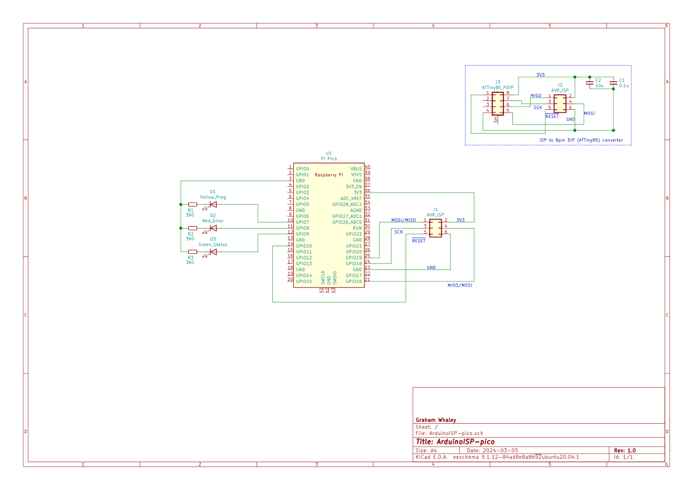
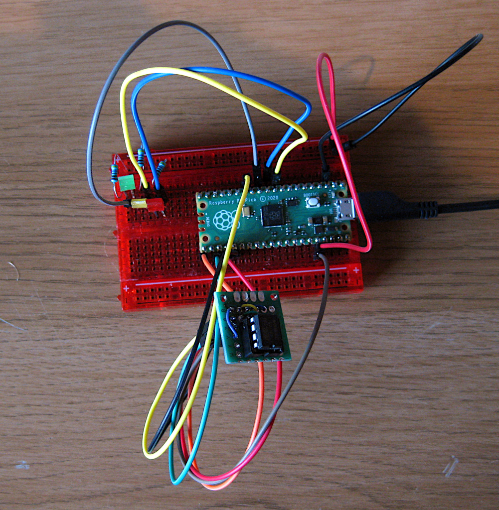
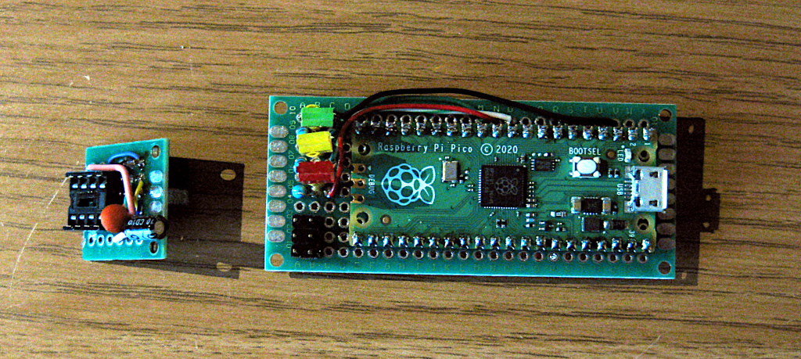

# AruduinoISP on a Pi Pico

At some point I want to play with
[ATTiny85 microprocessors](https://www.microchip.com/en-us/product/attiny85)
because, well, they are *so cute*. But, to work with them you need some way of flashing them.

My intention was to, at least initially, work from the Arduino IDE. Looking around, it looks like
you can
[make an AVR ISP programmer from an Arduino](https://github.com/arduino/arduino-examples/tree/main/examples/11.ArduinoISP/ArduinoISP)
Well, that fits perfectly for me...

Now, I don't actually own many real 'Arduino' boards, but I do own quite a few compatible boards,
and that ArduinoISP sketch does not look like it has any real hardware specific requirements, per-se.

And thus, I evaluated which boards I did have available, and decided to try and make an ISP from a
[Pi Pico](https://www.raspberrypi.com/products/raspberry-pi-pico/), as I had a number of them to
hand, and they are very cheap and easy to get.

## Building the sketch

The Sketch easily builds for a Pi Pico, no changes required. That's easy. In fact, you don't need to
use the Sketch provided in this repository, you can just use the one straight out of the Examples.

## Looking at the pinout

The big question was, will the Sketch default pinout align with the Pi Pico physical pins in a manner
that we can use. The simple answer is, yes. The below table shows the pinouts on the Pi Pico and how
they map to either an LED or a pin on the 2x6 AVR ISP programming header, and how those pins then
map through to an 8-pin DIL `ATTiny85` chip. Take note that the SPI notion of MOSI and MISO are
relative to the master or slave, depending on which end you are looking from - thus, you wire the
MOSI from the master to the MISO of the slave and vice versa. It is easy to get them mixed up and
end up wiring MOSI to MOSI for instance, which will not work. Pay careful attention in that area when
wiring up.

| Function       | PicoGP      | 2x6 ISP | Attiny85 8pin |
| -------------- | ----------- | ------- | ------------- |
| Prog LED  (Y)  | GP7         |         |               |
| Error LED (R)  | GP8         |         |               |
| Hrtbt LED (G)  | GP9         |         |               |
| RESET          | GP10        | 5       | 1             |
| MOSI           | GP19 (MOSI) | 4       | 6 (MISO)      |
| MISO           | GP16 (MISO) | 1       | 5 (MOSI)      |
| SCK            | GP18        | 3       | 7             |
| 3V3            | pin36       | 2       | 8             |
| GND            | pin3        | 6       | 4             |

## Schematic

Here is the schematic representation of that, along with the wiring from the 2x6 ISP header to an
8pin DIL socket to place the `ATTiny85` into.

Note the decoupling capacitors on the adapter. I am using the
[ATTinyCore](https://github.com/SpenceKonde/ATTinyCore/)
Arduino board support for my `ATTiny85`. I strongly recommend reading the
[page on wiring requirements](https://github.com/SpenceKonde/ATTinyCore/blob/v2.0.0-devThis-is-the-head-submit-PRs-against-this/avr/extras/Ref_Wiring.md) in that repository before you wire up your `ATTiny85`
device.

## Prototyping

Time to test out the theory. Plug up a Pi Pico on a breadboard and build a tiny 2x6 to 2x8 chip
programming converter:

OK, before I plugged in an `ATTiny85` I did a multimeter check to ensure I at least had the `3V3` and
`GND` wired to the right pins. This is probably the minimum test you want to do. Buzzing out all
the connections with your multimeter to ensure you have things wired how you expect is recommended.

Ideally you'd have an oscilloscope and be able to monitor the `RESET` and SPI lines during a trial
flash cycle without a chip in the socket - but, I don't have a scope to hand, so skipped that.

Then I basically followed this procedure:

  Note: I'm not giving fine details on how to program an `ATTiny85` here - that is not what this
  repo is really about...

  -  Burn the ArduinoISP sketch into the Pi Pico
  -  Load up the `Blinky` example, modify the `led` to be `PIN_PB1` for the `ATTiny85`
  -  Set the board to an `ATTiny85`, with no bootloader
  -  Burn the bootloader, and check in the progress output that the programmer was corretly found
     and that the `ATTiny85` was correctly identified, and the fuses were correctly programmed and
     verified

If all that went well, congratulations, you can an ISP programmer.

## Putting it together

And then it was time to put it into a more permanent form. I chose to mount the Pi Pico on a small
piece of solder board and solder everything in.

## Local .ino mods

You will find a copy of the original Example .ino file in this repository. It has very few modifications
to it, and you can just use the example file and that will be fine.

I changed a couple of things about the original just to suit my local tastes more. The changes are:

  - On bootup, flash the LEDs for longer. The original barely flickered them, which made it had to
    spot that bootup was OK.
  - And, re-order the LED flashes into 'colour order'. I used R/G/B for the LEDs (it seemed right), and
    thus wanted to flash them in that colour order (... like traffic lights!).
